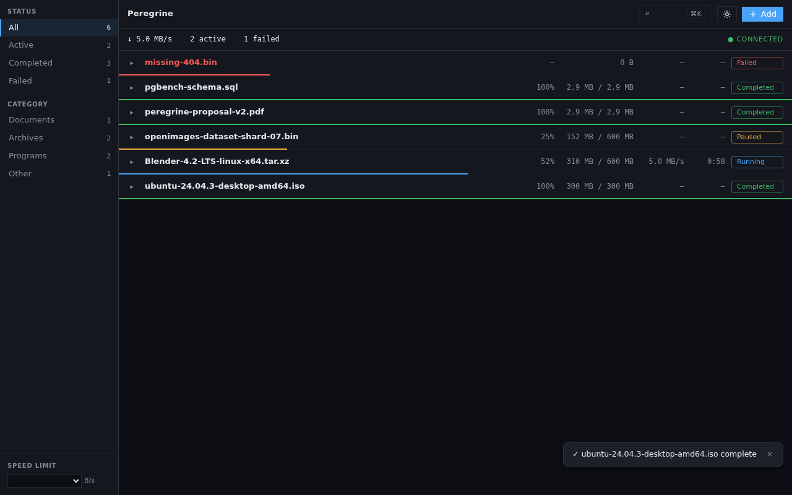
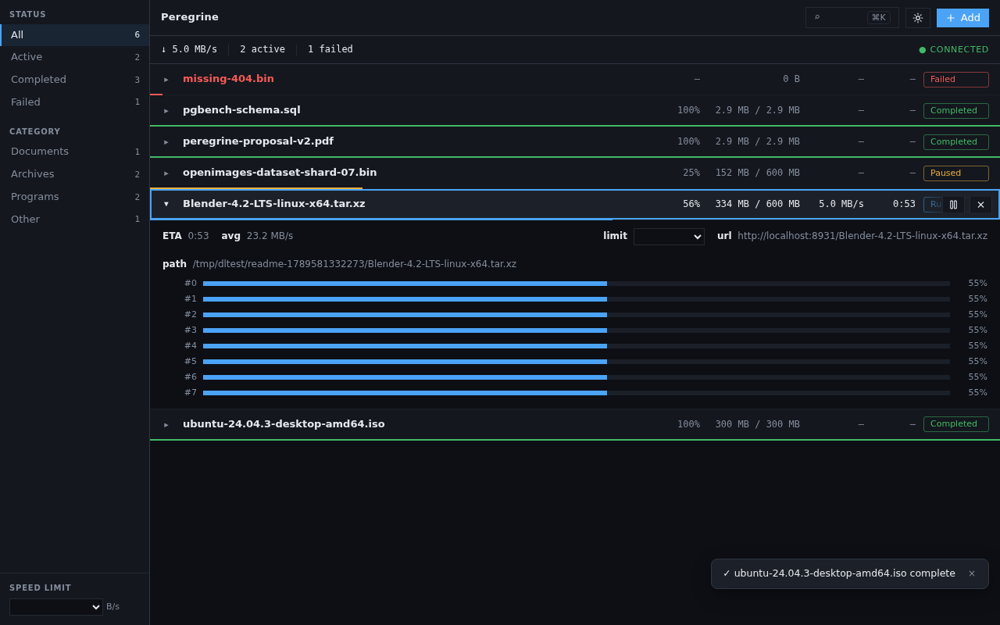
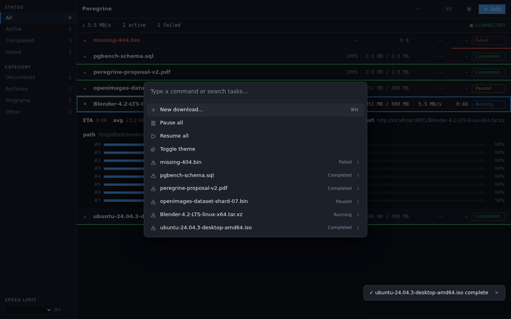
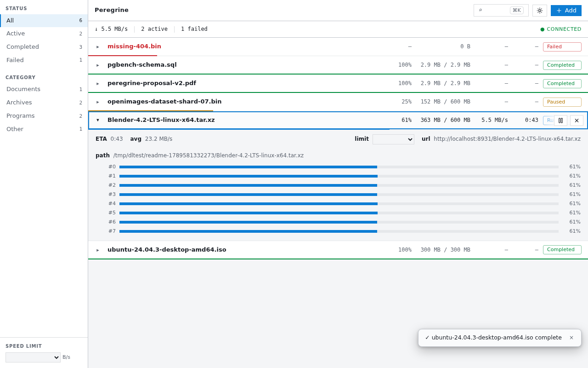

# Peregrine 🦅

> **游隼** — 俯冲时速 389 km/h 的地球最快动物，同时捕猎多个目标。

**Linux 首个「IDM 级加速 + Agent 原生」开源下载器。**

- ⚡ 自研 Rust 下载内核：IDM 式动态文件分段 + 自适应并发 + kill -9 断点续传，连接级遥测
- 🤖 MCP 一等公民：Claude / 任意 AI Agent 直接调度下载任务（10 工具 / 3 资源 / 事件推送）
- 🧩 headless daemon 架构：GUI / CLI / MCP 全是客户端，协议即插件

## v2.0.0-alpha.1 交付清单

| 能力 | 状态 |
| --- | --- |
| HTTP/HTTPS 多段下载 + 续传 + 限速 | ✅ M1 |
| 任务系统（队列/优先级/全局预算/WS 事件） | ✅ M2 |
| Web GUI + Tauri 2 桌面壳（托盘/单实例） | ✅ M3 |
| HLS VOD + live 录制 · FTP · BT/Magnet | ✅ M4 |
| MCP 服务器（stdio + streamable-HTTP） | ✅ M5 |
| 打包（tarball/deb/release CI） | ✅ M6 |

268 项测试 · clippy 零告警 · 每里程碑三轮审查（自查→独立复审→反思），
全部记录在 [docs/reviews/](docs/reviews/)。

## 界面

UI V2 —— 对标 Linear 的平铺网格（sharp edges，无圆角卡片）：左侧 192px 过滤侧栏（状态 × 分类 × 计数）+ 40px 全局状态条（↓↑ 实时速率、活动/失败计数，断连时整条变琥珀并冻结列表保留数据）+ 主区任务列表。每行 40px：文件名 / 大小 / 速度 / ETA / 状态 pill，tabular-nums 等宽数字，悬停浮出动作，选中行内嵌展开段级视图（每 Range 一条微条，IDM 招牌视角）。亮暗双主题同构（同一套 OKLCH token，主文字对比度双双 AAA 级）。

键盘优先：⌘K 命令面板（动作 + 任务模糊搜索，`/` 直达）、⌘N 新任务、Space 暂停/恢复、Del 移除（5s undo toast）、`?` 速查表。所有操作乐观更新（实测反馈 ≤120ms）+ REST 回执替换，失败自动回滚。

GUI 是纯薄客户端（Svelte 5 + Tailwind 4）：零业务逻辑，全部走 daemon 的 REST + WS，所以 CLI / MCP / GUI 三端能力永远一致。桌面形态为 Tauri 2 壳：系统托盘、下载完成原生通知、sidecar 自动拉起 daemon、单实例守护。

**暗色主题**（运行中 / 暂停 / 完成 / 失败混态，真实下载截图）：



**段级视图**（选中行内嵌展开，连接级遥微条）：



**⌘K 命令面板**（动作 + 任务搜索）：



**亮色主题**（同构 token，一秒切换）：



## 真机基准（v2.0.0-alpha.1）

[](assets/benchmark-v2-alpha1.svg)

慢公网链路（欧洲 tele2 源）实测 **3.1× 加速**：curl 单流 59.8s vs peregrine 19.3s（20MB，8 段并行）；内网镜像双双跑满 30MB/s；不支持 Range 的源自动降级单流，不浪费连接。所有下载文件 md5 与 curl 基线逐字节一致。复现方式见图内脚注。

## 快速开始

### CLI / GUI

```bash
# 启动 daemon（UDS 默认；--tcp 额外开 127.0.0.1:8800 供事件推送）
peregrined --tcp

# 下载
pg add https://example.com/big.iso -o ~/big.iso
pg list
pg limit <id> 2M        # 单任务限速（HTTP/HLS/FTP）
pg remove <id> --purge  # 删除任务并清数据（默认保留数据）
pg speed 10M            # 全局限速

# GUI（桌面壳另行构建）
```

### MCP

```bash
peregrined --tcp     # 1. daemon
peregrine-mcp        # 2. MCP 服务器（stdio；零参数即配对）
```

`peregrined --tcp` 监听 127.0.0.1:8800，`peregrine-mcp` 的事件桥默认连
`ws://127.0.0.1:8800/events`。socket 解析（PGRG_SOCKET → XDG_RUNTIME_DIR →
/tmp 回退）三端共用同一函数。

### 从源码构建

```bash
cargo build --release --locked        # 全部二进制
bash scripts/package.sh               # tarball + sha256（dist/）
bash scripts/package.sh deb           # 另加 .deb（需 cargo-deb）
```

### Shell 补全 / 手册页 / systemd（M6-c）

```bash
pg completions bash > ~/.local/share/bash-completion/completions/pg   # 或 zsh/fish
sudo mkdir -p /usr/local/share/man/man1 && pg gen-man /usr/local/share/man/man1

# 用户级（UDS，无需 root）：
install -Dm644 assets/peregrined.service ~/.config/systemd/user/peregrined.service
systemctl --user enable --now peregrined

# 系统级（TCP 实例，@后是端口）：
# 先建服务用户与下载目录（单元以 peregrine 运行，永不 root）：
sudo useradd --system --home /var/lib/peregrine --shell /usr/sbin/nologin peregrine
# ExecStart 需按环境修改（下载目录/二进制路径），先读单元内注释
sudo cp assets/peregrined@.service /etc/systemd/system/
sudo systemctl daemon-reload && sudo systemctl enable --now peregrined@8800
pg --socket tcp:8800 ping            # 裸端口等价于 pg --socket tcp:127.0.0.1:8800
```

## 协议支持

HTTP/HTTPS（多段+镜像降级）· FTP（被动模式+REST 续传）· HLS（VOD 全量 +
live 滑窗录制）· BitTorrent/Magnet（librqbit embed，同 hash 引用计数，
DHT 默认关、持久化关）

## 已知限制（v2.0.0-alpha.1）

- BT 任务暂不支持单任务限速（全局限速有效；librqbit ratelimits 在 BACKLOG）。
- MCP 订阅用 legacy `resources/subscribe`（Claude Desktop 当前方言）；
  `subscriptions/listen` 在 BACKLOG。
- `--http` 模式无鉴权，默认绑回环；不要暴露到非回环地址。
- 桌面包（AppImage/dmg）由 CI 构建，本地脚本只出 headless 产物。

里程碑计划见 [docs/design/PROPOSAL.md](docs/design/PROPOSAL.md)。

## 技术栈

Rust (tokio) 内核 + Tauri 2 + Svelte 5 桌面端 + rmcp (官方 MCP Rust SDK) + librqbit (BT)

---

*本项目与任何前作无关，是全新 clean-room 项目。License: MIT*
