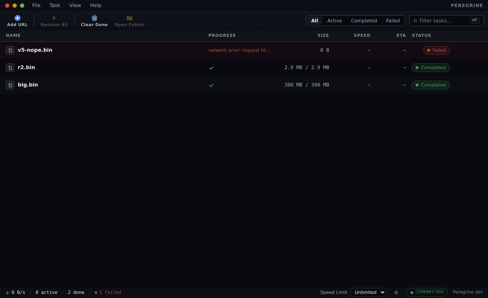
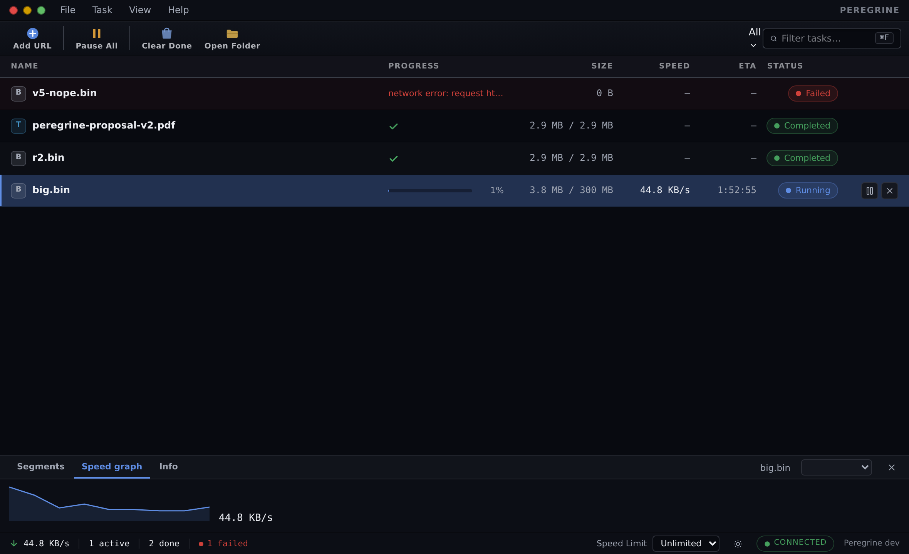
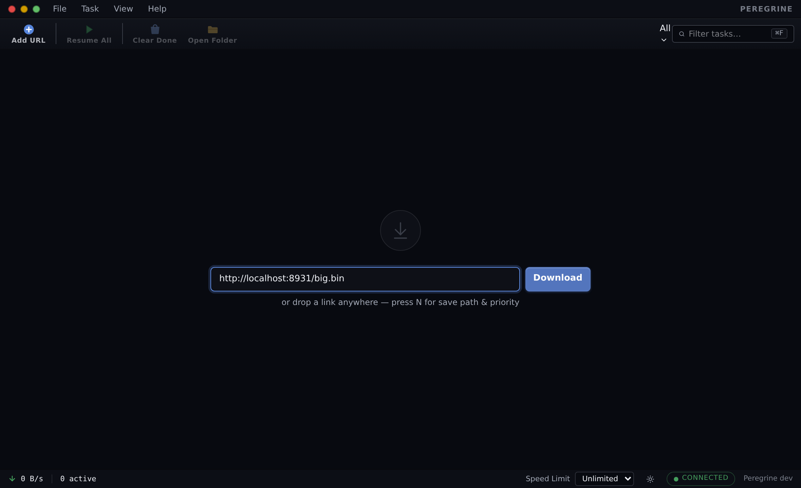
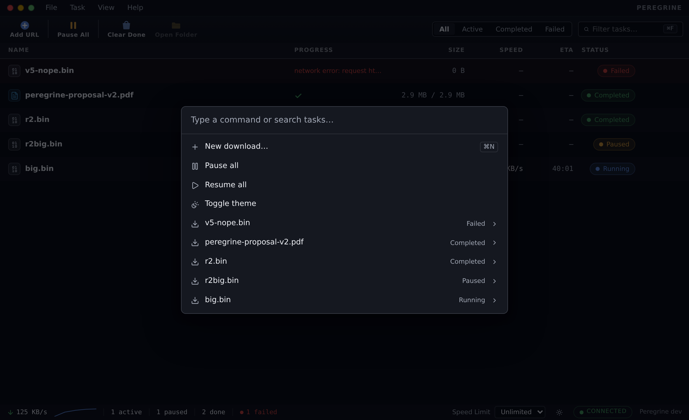
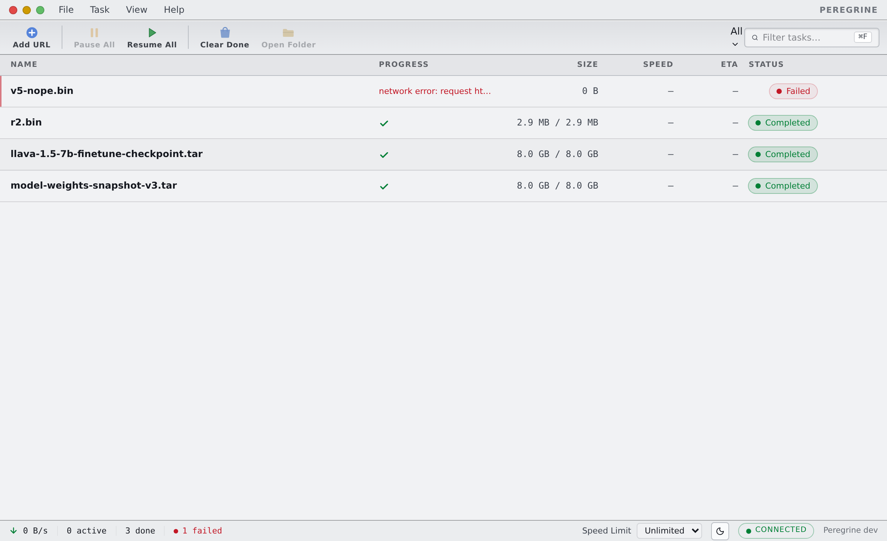
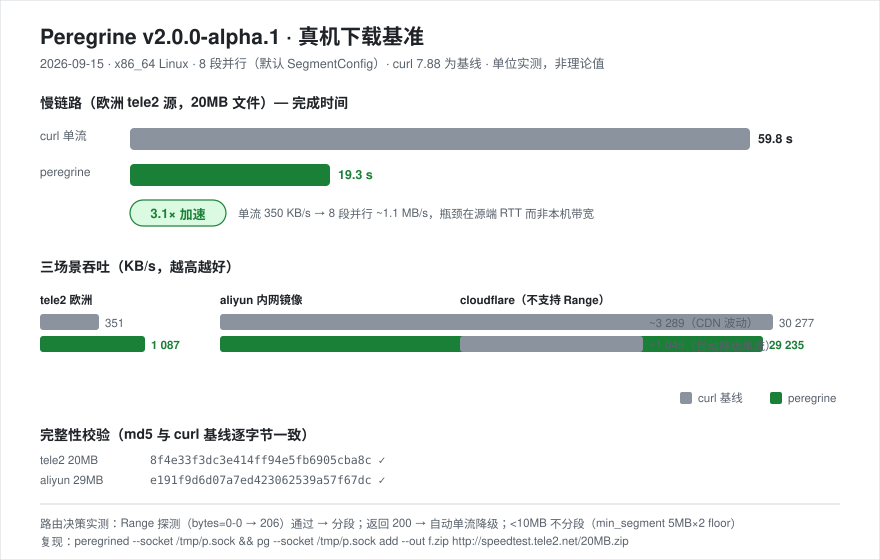

# Peregrine 🦅

> **游隼** — 俯冲时速 389 km/h 的地球最快动物，同时捕猎多个目标。

> **English:** An open-source Linux download manager — an IDM-class multi-segment acceleration
> kernel with native AI-agent scheduling over MCP. One daemon, three clients: CLI, GUI, and MCP.
> Docs below are in Chinese; issue reports in either language are welcome.

**Linux 上的开源下载器：IDM 级多段加速内核 + AI Agent 原生调度，CLI / GUI / MCP 三端同构。**

[](https://github.com/SonicBotMan/peregrine/actions/workflows/ci.yml)
[](https://github.com/SonicBotMan/peregrine/actions/workflows/desktop.yml)
[](https://github.com/SonicBotMan/peregrine/releases)
[](LICENSE)

## 为什么是 Peregrine

- ⚡ **自研 Rust 内核**：IDM 式分段下载 + **动态重平衡**（空闲连接自动偷走慢段尾部分片），慢公网链路实测 **3.1× 加速**；`kill -9` 级断点续传、416 偏移自愈、连接级遥测
- 🤖 **MCP 一等公民**：Claude / 任意 AI Agent 直接管理你的下载任务——10 个工具、3 类资源、实时事件推送，`peregrine-mcp` 零参数即配对
- 🧩 **headless daemon 架构**：GUI / CLI / MCP 全是薄客户端走同一套 REST + WS，三端能力永远一致，协议即插件
- 🖥️ **桌面级 GUI**（Tauri 2 + Svelte 5）：工具式表格、段级视图、⌘K 命令面板、零步添加、亮暗双主题

## 界面

**暗色主界面**（文件类型图标 / 内联进度 / 优先级徽标 / ETA 排序，真实下载截图）：



**详情抽屉**（选中行展开：Segments 段级微条 / Speed graph 实时曲线 / Info）：



**零步添加**（空列表即下载表单：粘贴链接回车即下；窗口获焦时侦测剪贴板新链接，一键 Download——只提示、永不自动添加）：



**⌘K 命令面板**（动作 + 任务模糊搜索，`/` 直达）：



**亮色主题**（同一套 OKLCH token，一秒切换）：



键盘优先：⌘N 新任务、Space 暂停/恢复、Del 移除（可撤销 toast，涉及删文件时二次确认且默认不删）、`?` 速查表。所有操作乐观更新 + REST 回执替换，失败自动回滚。

## 特性

| 能力 | 说明 |
| --- | --- |
| HTTP/HTTPS 多段下载 | 静态分段 + **运行时动态重平衡**（空闲槽偷慢段尾部）；不支持 Range 的源自动降级单流 |
| 多源镜像 + 自动重试 | 主源探活失败自动依序尝试镜像；失败自动重试（指数退避 + 抖动）|
| 代理支持 | HTTP(S) CONNECT 隧道 + SOCKS5（含用户名密码认证），设置中心可配 |
| 断点续传 | 文件级状态持久化，进程被杀也按字节精确恢复；偏移异常自愈（416 → 重置重试） |
| FTP | 被动模式 + REST 续传 |
| HLS | VOD 全量 + live 滑窗录制，快速失败 |
| BitTorrent / Magnet | librqbit 内嵌，同 hash 引用计数；任务详情含实时 peers 面板 |
| 任务管理 | 队列 / 优先级（High·Normal·Low 全链路调度）/ 单任务与全局限速 / 全局并发预算 |
| 事件推送 | WS 实时事件，GUI / MCP 共用 |
| 通知与托盘 | 系统托盘（Add / Pause all / Resume all / 动态 tooltip）、下载完成原生通知、单实例守护 |

## 安装

**预编译包**（Linux x86_64）：

```bash
# 从 Releases 下载最新 tarball（含 peregrined / pg / peregrine-mcp + sha256）
https://github.com/SonicBotMan/peregrine/releases
tar xf peregrine-*-x86_64-unknown-linux-gnu.tar.gz
```

**Windows x86_64**（原生安装包，CI 每次推送构建）：

从 [Releases](https://github.com/SonicBotMan/peregrine/releases) 下载
`*-x86_64.msix` 之外的安装器之一：

- `peregrine_*_x64_zh-CN.msix` 不适用时选 **MSI**（`peregrine-*.msi`，企业/GPO 友好）
- 或 **NSIS** 安装器（`peregrine-*-setup.exe`，向导式安装）

安装包含 GUI（`Peregrine.exe`）与随附的 `peregrined.exe` sidecar：
GUI 启动时自动拉起 daemon（回环 TCP 8420）。CLI（`pg` / `peregrine-mcp`）
默认连 `tcp:127.0.0.1:8420`，无需配置。要求 Windows 10 1803+（WebView2
缺失时由安装器自动装）。

**从源码构建**（Rust 1.75+）：

```bash
git clone https://github.com/SonicBotMan/peregrine.git
cd peregrine
cargo build --release --locked        # 全部二进制
bash scripts/package.sh               # tarball + sha256（dist/）
bash scripts/package.sh deb           # 另加 .deb（需 cargo-deb）

# 桌面 GUI（Tauri 2）
cd apps/desktop && pnpm install && pnpm tauri build
```

## 快速开始

**CLI**：

```bash
peregrined --tcp                # 1. 启动 daemon（UDS 默认；--tcp 额外开 127.0.0.1:8800）
                                #    多用户机器上加 --auth-token <TOKEN>（或 PGRG_TOKEN 环境变量）
                                #    给 TCP 面加一层 Bearer 鉴权，UDS 不受影响

pg add https://example.com/big.iso -o ~/big.iso   # 下载
pg list                                           # 任务列表
pg limit <id> 2M                                  # 单任务限速
pg speed 10M                                      # 全局限速
pg remove <id>                                    # 移除任务（默认保留数据，--purge 连文件删）
```

**MCP**（让 Claude 等 Agent 管理下载）：

```bash
peregrined --tcp                  # daemon
peregrine-mcp                     # MCP 服务器（stdio），在 Claude Desktop / 任意 MCP 客户端中配置即可
                                  # daemon 带 --auth-token 时：peregrine-mcp --token <TOKEN>（或 PGRG_TOKEN）
```

**GUI**：桌面壳自动拉起 daemon（sidecar），开箱即用。

Shell 补全 / 手册页 / systemd 单元（用户级免 root + 系统级专用服务用户）：

```bash
pg completions bash > ~/.local/share/bash-completion/completions/pg
pg gen-man /usr/local/share/man/man1
install -Dm644 assets/peregrined.service ~/.config/systemd/user/peregrined.service
systemctl --user enable --now peregrined
```

## 基准（v2.0.0-alpha.1 实测）

[](assets/benchmark-v2-alpha1.svg)

慢公网链路（欧洲 tele2 源）**3.1×**：curl 单流 59.8s vs Peregrine 19.3s（20MB / 8 段并行）；内网镜像双双跑满 30MB/s；所有产物 md5 与 curl 基线逐字节一致。复现方式见图内脚注。

## 架构

```
crates/
  engine-http / engine-hls / engine-ftp / engine-bt   # 协议引擎（同一 EngineEvent 模型）
  scheduler     # 优先级队列 + 全局预算
  task-manager  # 状态机 + 文件级持久化
  daemon        # REST + WS 事件（headless 核心）
  cli           # pg
  mcp           # peregrine-mcp（rmcp，官方 MCP Rust SDK）
apps/desktop    # Tauri 2 + Svelte 5 薄客户端（零业务逻辑）
```

设计文档与逐里程碑审查记录见 [docs/design/](docs/design/) 与 [docs/reviews/](docs/reviews/)。

## 状态与路线图

当前 **v2.0.0-alpha.3**：292+ 项测试、clippy 零告警、CI 全绿。alpha 阶段，接口可能调整。

已知限制：

- BT 任务暂不支持单任务限速（全局限速有效）
- MCP 订阅用 legacy `resources/subscribe`（Claude Desktop 当前方言）
- TCP 面默认无鉴权且只绑回环（`--auth-token` 可加 Bearer 鉴权，`/health` 探活豁免）；不要把 daemon 暴露到非回环地址
- 桌面安装包：Linux（deb/AppImage）✓、Windows（MSI/NSIS）✓ 均由 CI 在推送/打 tag 时构建并附到 Release；macOS（dmg）待做
- Windows 控制面为回环 TCP（无 UDS）：`pg` 默认 `tcp:127.0.0.1:8420`；多用户场景同样建议 `--auth-token`

下一步：macOS（dmg）签名分发、批量选择操作、BT 运行时限速（librqbit limits）、多语言。

## 参与开发

```bash
cargo test --workspace                 # 292+
cd apps/desktop
pnpm exec vitest run                   # 前端 20 项
pnpm exec svelte-check --tsconfig ./tsconfig.app.json   # 与 CI 逐字对齐
```

开发环境、E2E 探针、截图与 VLM 盲评流程、CI 对齐验证门：[docs/dev-tools.md](docs/dev-tools.md)。验收流程：每个变更走 自查 → 独立复审 → 反思 三轮，记录在 docs/reviews/。

## License

[Apache-2.0](LICENSE)。本项目为全新 clean-room 实现，与任何前作无关。
